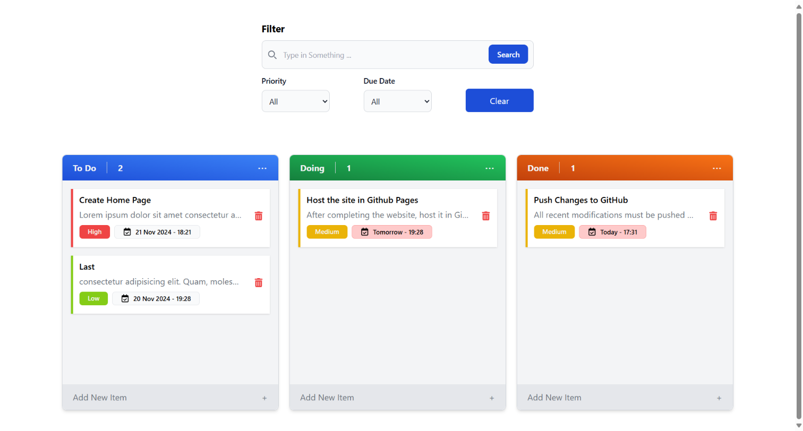

# Copie-de-Systeme-de-Gestion-des-Taches---To-Do-List

A simple and interactive To-Do List application built with HTML, CSS, and JavaScript. This app allows users to add, remove, and check off tasks with smooth animations for an enhanced user experience.

## Features

- **Add Tasks**: Easily add new tasks to your to-do list.
- **Remove Tasks**: Remove tasks that are no longer needed.
- **Modify Tasks**: Modify tasks details
- **LocalStorage**: Tasks are saved in localStorage
- **Move Tasks**: Move tasks to doing or done when they are completed.
- **Responsive Design**: Works well on both desktop and mobile devices.
- **Animations**: Smooth transitions and animations for adding and removing tasks.

## Technologies Used

- **HTML**: For the structure of the app.
- **CSS**: For styling and animations.
- **JavaScript**: For interactive functionalities.

## Screenshots
